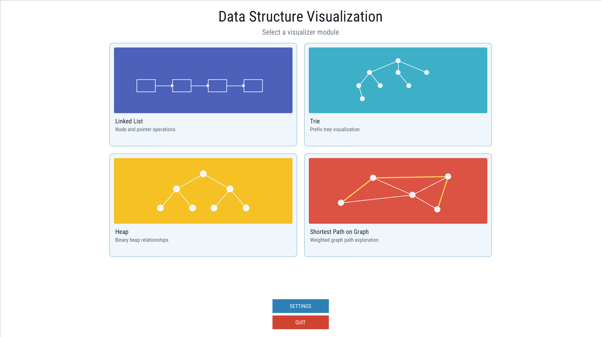
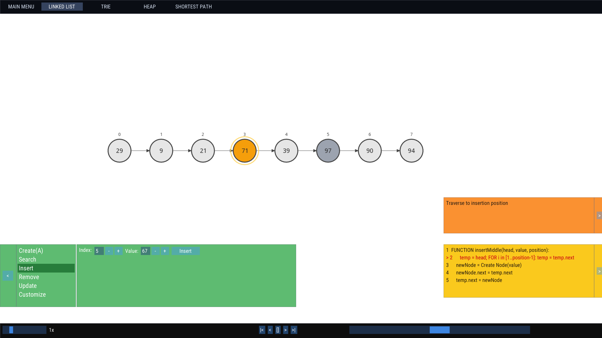
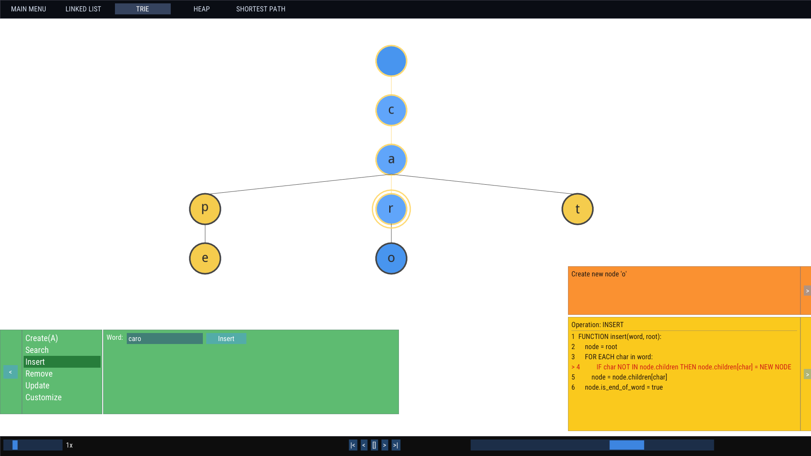
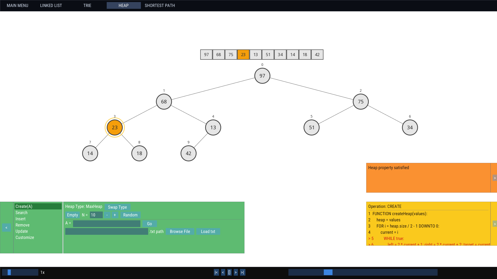
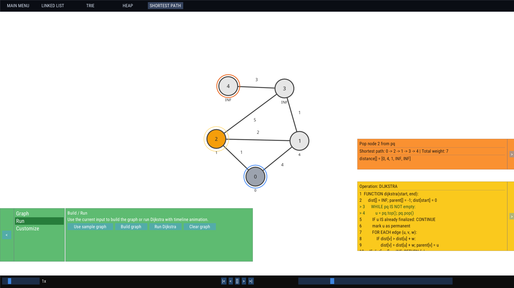

# Data Structure Visualization

An interactive desktop application for visualizing data structures and algorithms through animated playback, highlighted states, and step-by-step execution.

The project's UI is inspired by [https://visualgo.net](https://visualgo.net)

## Team

This project was created for **CS163 - Data Structures and Algorithms** at **HCMUS** by:

- Trần Phúc Khánh - 25125020
- Lê Hồng Đăng - 25125040
- Phạm Gia Bảo - 25125080
- Lương Nhật Minh - 25125088

## Overview

The goal of this project is to make core data structures and graph algorithms easier to understand by showing how each operation changes the internal state over time.

The application is built with:

- **C++17**
- **SFML 3**
- **Dear ImGui**
- **ImGui-SFML**
- **CMake**

It provides a desktop UI where users can switch between modules, input data manually or from files, and watch operations unfold visually.

## Implemented Modules

### Singly Linked List



### Trie



### Heap




### Shortest Path



## Build Instructions

### Requirements

- A C++17-compatible compiler
- [CMake 3.28+](https://cmake.org/download/)
- Git

### Build

From the project root, run:

```bash
cmake -B build
cmake --build build --config Release
```

### Run

After building, run the generated `DataVisualization` executable from the build output directory.

## Dependencies

Project dependencies are fetched automatically through CMake using `FetchContent`.

The main dependencies are:

- [SFML](https://github.com/SFML/SFML)
- [Dear ImGui](https://github.com/ocornut/imgui)
- [ImGui-SFML](https://github.com/SFML/imgui-sfml)

## Continuous Integration

This repository includes a GitHub Actions workflow that builds the project on:

- Windows
- Linux
- macOS (File browser does not support macOS)

The CI pipeline also checks both shared and static configurations.

## License

See [LICENSE.md](LICENSE.md) for license details.
